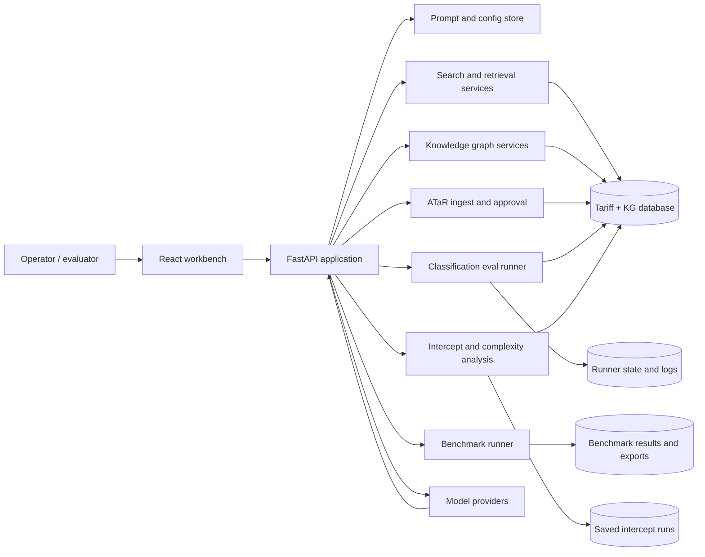
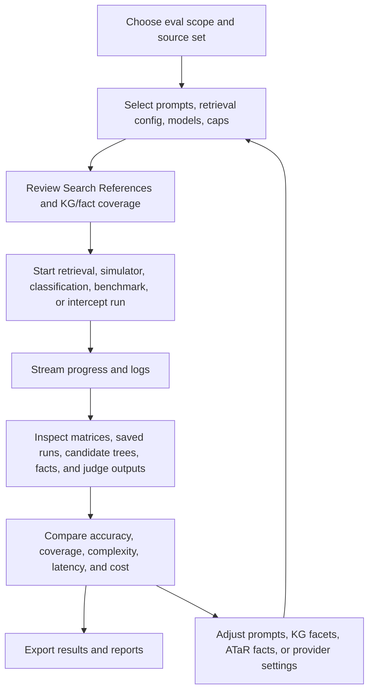

# AI Search Evaluation Suite

AI Search Evaluation Suite is a standalone deployable app for tariff
classification/search evaluation and experimentation. It combines a React
workbench, FastAPI services, retrieval and classification evaluation runners,
knowledge graph tooling, ATaR workflows, intercept analysis, and provider
benchmarking in one operator-focused application.

## What It Does

- Runs retrieval/search experiments over tariff candidates, reference material,
  prompt variants, and provider/model configurations.
- Provides a prompt and configuration workbench for comparing retrieval,
  classification, judge, simulator, and benchmark settings.
- Exposes Search References for reviewing the source context used by retrieval,
  prompt generation, classification, and audit panels.
- Runs classification evaluations with a trader simulator, commodity-code (CC)
  fact sheets, Q&A turns, saved runs, and matrix-style result inspection.
- Supports ATaR ingest, draft generation, fact extraction, review, and approval
  flows.
- Provides a Knowledge workbench for KG coverage, facets, edges, graph browse,
  provenance/audit review, and controlled edit/delete operations.
- Runs benchmark jobs across configured model providers and exports results for
  comparison or offline analysis.
- Includes Analysis and Financial panels for cost tracking, provider comparison,
  run summaries, and experiment economics.
- Includes Intercepts and Complexity tooling for high-ambiguity search terms,
  streamed analysis, saved-run drilldowns, candidate trees, and complexity KPIs.

## Architecture



The deployable app is the classification-evaluation runner, which serves the
workbench UI and mounts the product evaluation APIs in a single process. It can
run against an existing tariff/KG database or a local Postgres/pgvector service
started by Docker Compose.

## Evaluation Workflow



## Repository Layout

| Path | Purpose |
|---|---|
| `apps/classification-evals/` | Standalone deployable app and long-running classification evaluation runner. |
| `apps/product/` | Shared workbench frontend and supporting backend modules mounted by the deployable app. |
| `apps/product/backend/` | FastAPI route modules for retrieval, KG, ATaR, simulator, judge, benchmark, analysis, financial, intercepts, and complexity tooling. |
| `apps/product/frontend/` | React/Vite workbench UI. |
| `apps/product/db/` | KG schema and deployable seed data artifacts when included in the export. |
| `docs/` and `apps/product/docs/` | Route, dependency, operations, source inventory, KG, and extension notes when included in the export. |

Generated outputs, local result files, runtime configuration, and database
snapshots are runtime state. Do not treat them as source documentation or
deployment defaults.

## Local Development Quickstart

Prerequisites:

- Python 3.11+.
- Node.js and npm.
- PostgreSQL with pgvector for live DB-backed flows.
- Optional provider API keys for model-backed actions.

Start the deployable evaluation app:

```bash
cd apps/classification-evals
cp .env.example .env
./start.sh
```

Open the local app at `http://localhost:8100`.

For static or fixture-backed inspection, provider keys can remain blank. Live
search, KG, classification eval, ATaR extraction, embeddings, judge, benchmark,
and intercept-generation flows require the relevant database and provider
configuration.

## Configuration

Copy the example environment file and fill in only the values needed for the
run mode:

```bash
cd apps/classification-evals
cp .env.example .env
```

Common variables:

| Variable | Purpose |
|---|---|
| `TARIFF_DB_DSN` | PostgreSQL DSN for the tariff and KG database. |
| `OPENSEARCH_URL` | Optional local OpenSearch URL for the keyword leg. |
| `OPENSEARCH_INDEX` | Local OpenSearch tariff commodity index name. |
| `TARIFF_DB_SCHEMA` | Tariff schema name. |
| `TARIFF_DB_KG_SCHEMA` | Knowledge graph schema name. |
| `OPENAI_API_KEY` | Optional provider key for OpenAI-backed actions. |
| `ANTHROPIC_API_KEY`, `GOOGLE_API_KEY`, `XAI_API_KEY`, `GROQ_API_KEY`, `OPENROUTER_API_KEY`, `CEREBRAS_API_KEY`, `DEEPSEEK_API_KEY`, `MISTRAL_API_KEY`, `SAMBANOVA_API_KEY` | Optional provider keys for benchmark and fan-out comparisons. |
| `AI_FAN_OUT_WORKBENCH_SPEND_ENABLED` | Enables provider-backed workbench actions when explicitly intended. |
| `CLASSIFY_EVAL_ALLOWED_MODELS` | Server-side allowlist for classification eval models. |
| `CLASSIFY_EVAL_MAX_RUNNING_JOBS` | Concurrency cap for long-running jobs. |
| `CLASSIFY_EVAL_MAX_EST_USD` | Cost estimate cap for eval job requests. |
| `AI_FAN_OUT_BEARER_TOKEN` | Optional deployment bearer token. |
| `AI_FAN_OUT_BASIC_AUTH_USER` / `AI_FAN_OUT_BASIC_AUTH_PASSWORD` | Optional deployment basic auth. |

Use placeholders such as `<database-dsn>`, `<provider-api-key>`, and
`<strong-password>` in examples and docs. Never commit real values.

## Deployment Notes

The platform deployment currently builds the repository-root `Dockerfile`. It intentionally runs only a small backend placeholder that responds `OKAY` at `/` and `/healthcheckz`; it does not package the existing frontend, connect to a database, or run evaluation features. Those capabilities will be integrated incrementally through backend APIs.

The full evaluation app currently lives in `apps/classification-evals/` for
local development and future platform integration. It is not included in the
placeholder deployment. Its Docker Compose setup runs the app with local
Postgres/pgvector and local OpenSearch services:

```bash
cd apps/classification-evals
cp .env.example .env
# edit .env with deployment placeholders or secret-store injected values
docker compose up -d --build
```

Hydrate the local OpenSearch commodity index from the VM database after the
tariff snapshot is loaded. The hydrator indexes only current-valid, non-stale
commodity self-text rows according to tariff validity dates:

```bash
docker compose exec classification-evals \
  python scripts/hydrate_opensearch_index.py --recreate
```

Before running paid or provider-backed jobs in a deployment:

- Put TLS and authentication in front of the app.
- Configure secrets through environment injection or a managed secret store.
- Keep provider-backed workbench spend disabled unless the deployment is
  intended to spend.
- Use server-side model allowlists, job concurrency caps, and estimated cost
  caps.
- Load only reviewed tariff/KG snapshots and exclude historical run data unless
  it is explicitly needed.

## Security And Data Hygiene

- Do not commit `.env` files, runtime config, provider keys, database passwords,
  bearer tokens, private URLs, local machine paths, screenshots containing
  secrets, or generated dumps.
- Store secrets in environment variables or a secret store; inject them at
  runtime.
- Keep fixtures and example data free of personal data, trader-identifying
  details, private prompts, and credentials.
- Put auth in front of every non-local deployment. Leave only health checks
  public when required by infrastructure.
- Treat model-provider calls as billable actions. Eval jobs should require an
  explicit spend opt-in and remain subject to server-side caps.
- Review exports before sharing. Benchmark results, saved runs, and audit rows
  can contain prompts, provider metadata, or source snippets.

## Further Reading

- `apps/classification-evals/README.md` for runner-specific operations.
- `apps/full/docs/API_ROUTES.md` for route groups.
- `apps/full/docs/KG_SCHEMA.md` for knowledge graph schema notes.
- `apps/full/docs/OPERATIONS.md` for operational guidance.
- `apps/full/docs/SOURCE_INVENTORY.md` for source and fixture inventory.
